# mpweixinA072
mpweixinA072移动学习平台微信小程序LW（Vue3+原生+unipp）
 
## 查看主页获取源码

### 一、作品包含

源码+数据库+设计文档万字+全套环境和工具资源+部署教程

### 二、项目技术

前端技术：Html、Css、Js、Vue3.0、Element-ui、Uniapp

数据库：MySQL

后端技术：Java、Spring Boot、MyBatis

  

### 三、运行环境

开发工具：IDEA/eclipse + HBuilderX + 微信开发者工具

数据库：MySQL5.7（最低要5.7版本）

数据库管理工具：Navicat10以上版本

环境配置软件： JDK1.8+Maven3.6.3

前端Nodejs：16

### 四、项目介绍
项目编号：mpweixinA072

基于微信小程序的移动学习平台的设计与实现，旨在为学生提供便捷、高效的学习资源获取与互动交流环境，促进个性化学习和教育资源的优化配置。

主要功能有：用户管理、课程信息管理、教学资源管理、试卷管理、试题管理、考试管理、学习社区管理、系统管理

### 五、运行截图

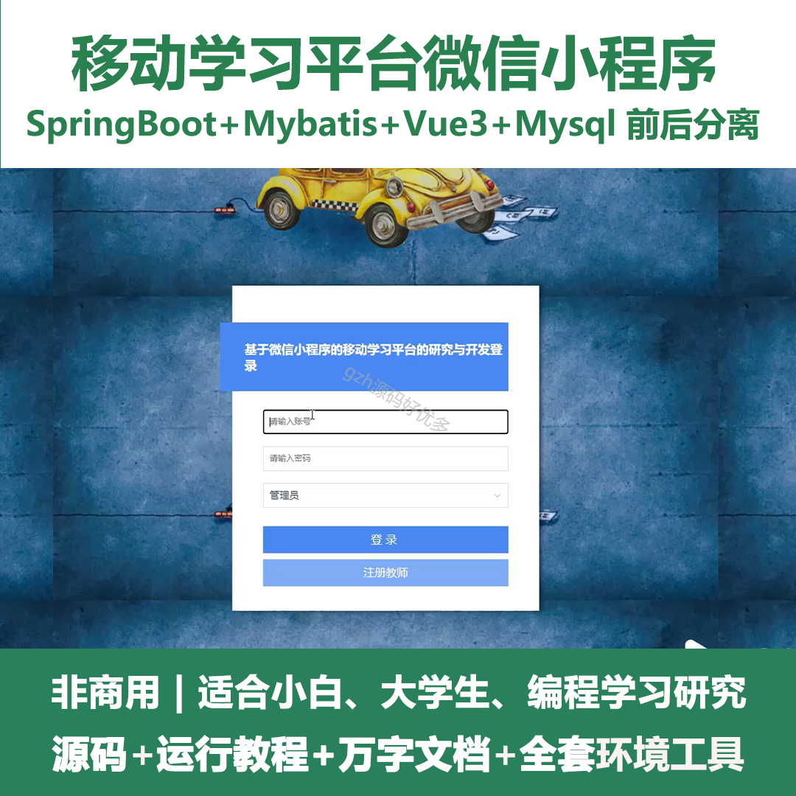
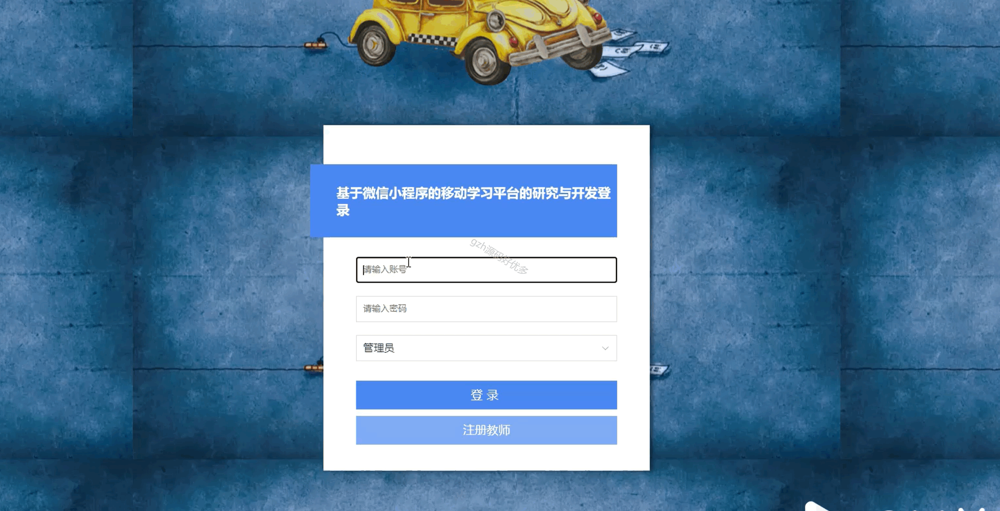
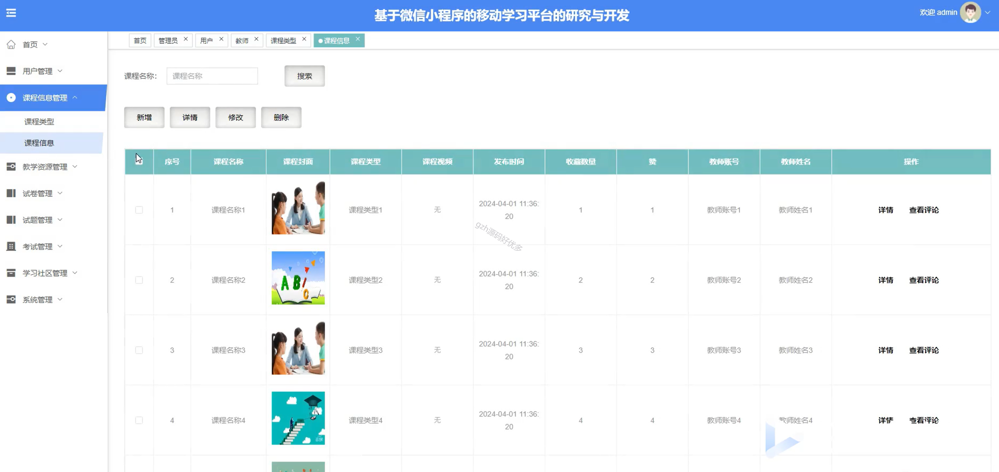
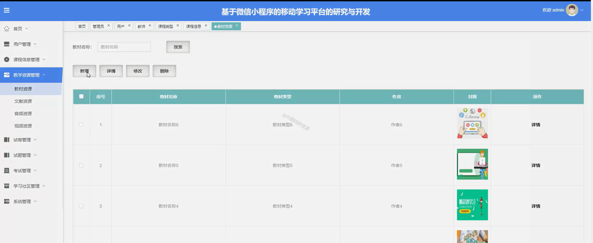
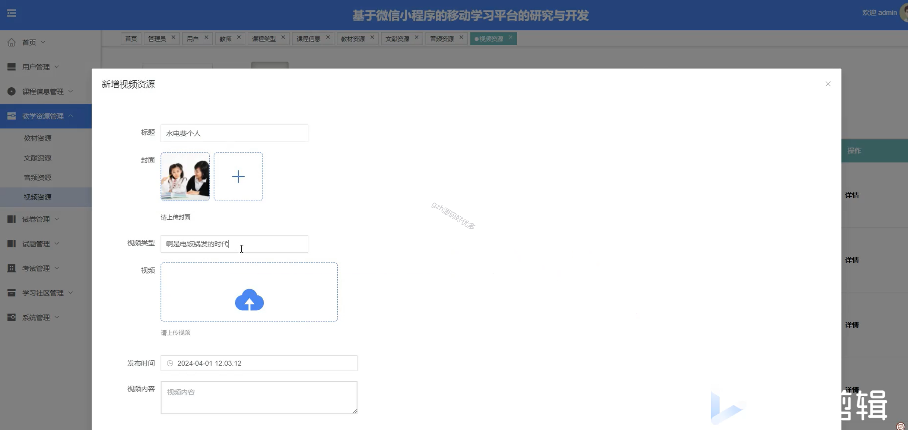
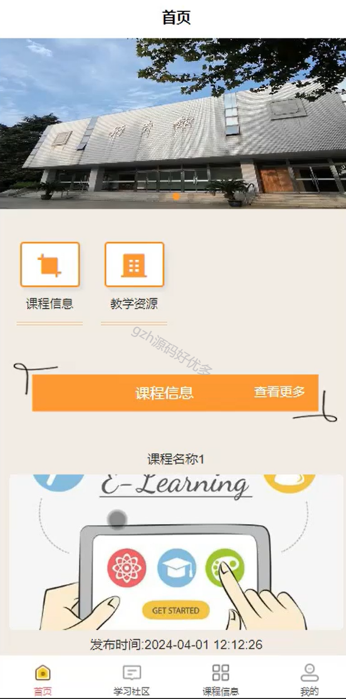
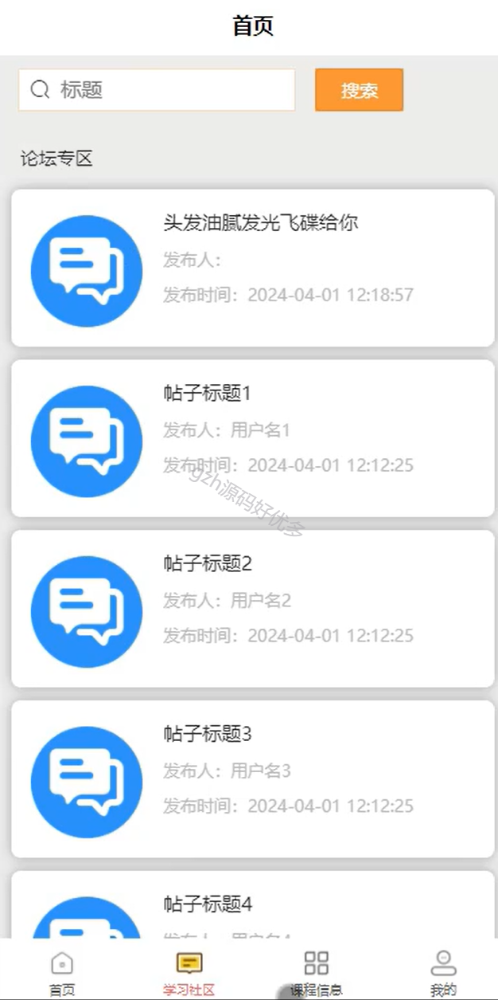
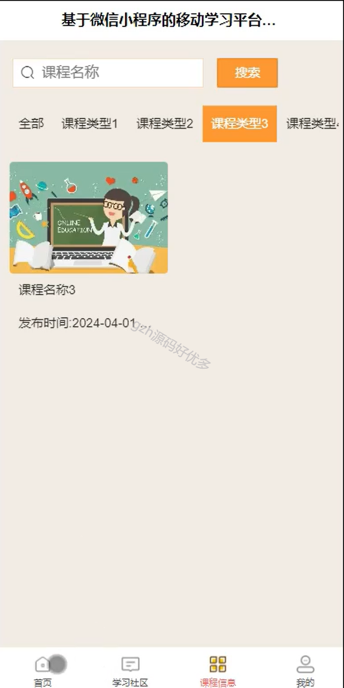
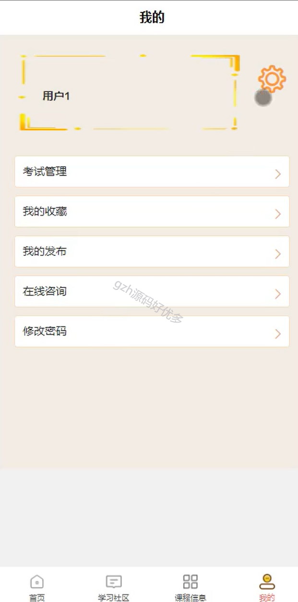
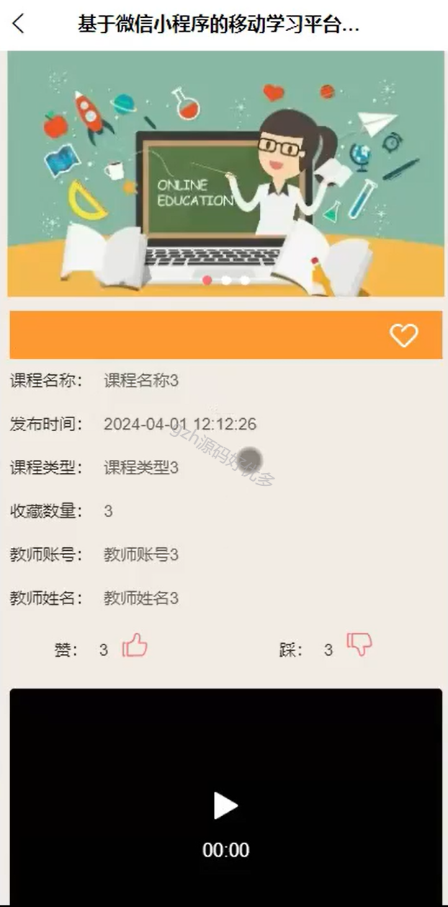
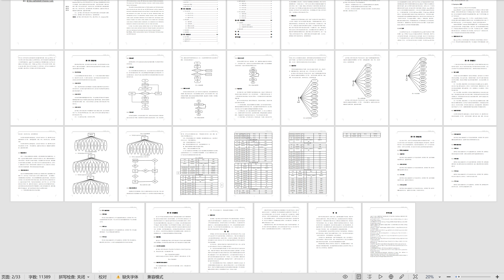

  
